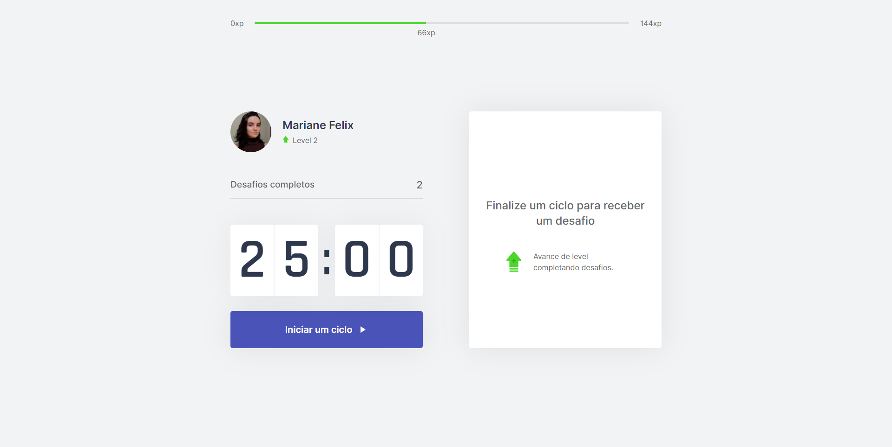
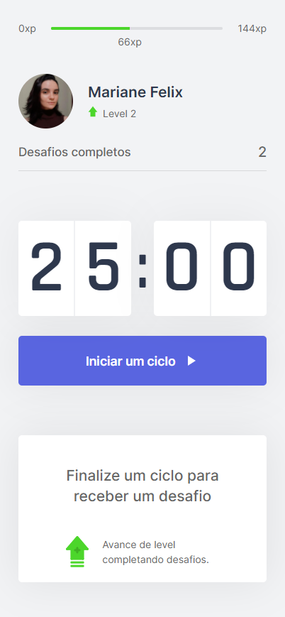

<a href="https://my-move-it-app.vercel.app/" target="_blank">
  <h1 align="center">
    
    Move.it
  </h1>
</a>

  

  

  

  <a href="#sobre">Sobre</a> –
  <a href="#tecnologias-e-recursos-utilizados">Tecnologias e recursos utilizados</a> – 
  <a href="#screenshots">Screenshots</a> – 
  <a href="#como-rodar">Como rodar?</a> –
  <a href="#autora">Autora</a>

## Sobre
O [Move.it](https://my-move-it-app.vercel.app/) foi desenvolvido durante a Next Level Week #4 da [Rocketseat](https://rocketseat.com.br/), e consiste em uma aplicação voltada, principalmente, para os desenvolvedores web que passam muito tempo sentandos em frente ao computador. Dessa forma, a cada novo ciclo de 25 minutos, o usuário é desafiado a realizar pequenos exercícios, e se completados, podem fazê-lo subir de nível.

## Tecnologias e recursos utilizados
[Reactjs](https://pt-br.reactjs.org/)  
[styled-components](https://styled-components.com/) - forma de estilizar componentes  
[Context API](https://pt-br.reactjs.org/docs/context.html) - forma de compartilhar estado  
[ESLint](https://marketplace.visualstudio.com/items?itemName=dbaeumer.vscode-eslint) e [Prettier](https://prettier.io/) - utilizados para padronizar escrita do código e evitar erros  

## Screenshots
O Move.it foi desenvolvido para se adaptar a qualquer tipo de tela, como é mostrado em algumas telas abaixo.  
#### Iniciar novo clico

    
    

